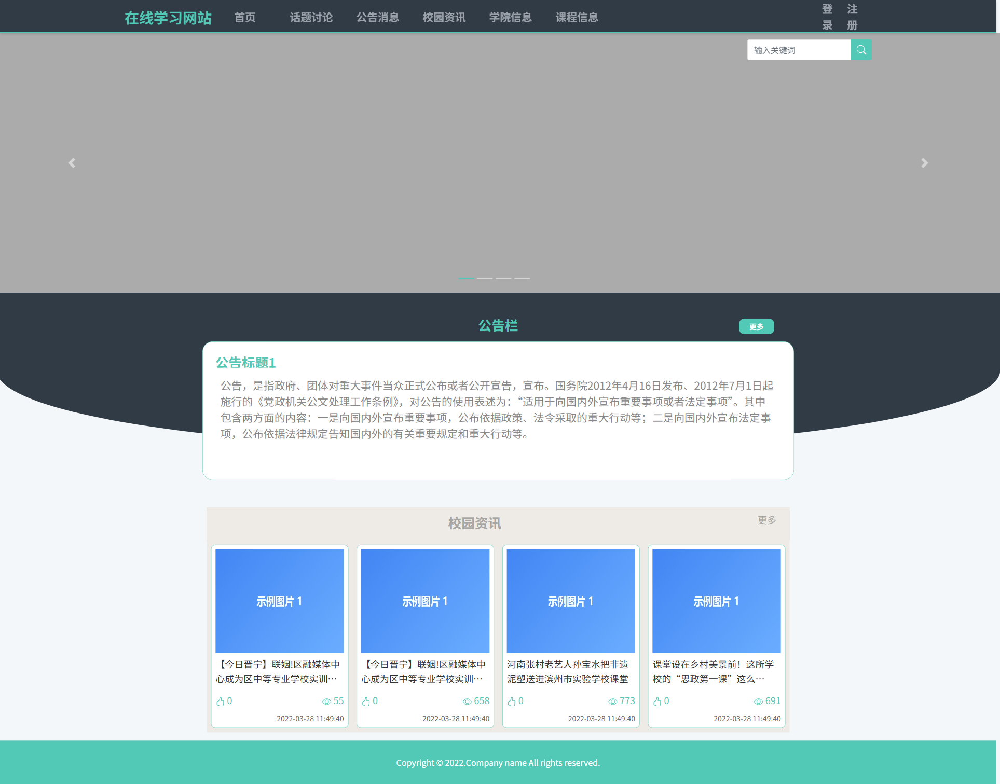
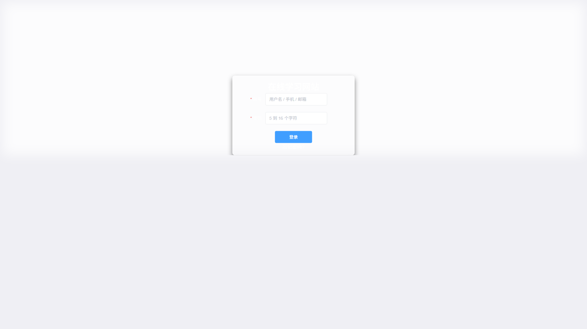

# 在线学习网站

> 🎓 **计算机毕业设计项目** | 本仓库为项目功能介绍与运行效果截图展示
>
> 🔥 **完整可运行源码 / 数据库脚本 / 论文等全套资料，请访问：[https://geekcode.top/project/springboot-mysql-在线学习网站/?utm_source=github](https://geekcode.top/project/springboot-mysql-在线学习网站/?utm_source=github)**
>
> 💬 微信：**ir9372**　|　🌐 更多项目：[极客代码 geekcode.top](https://geekcode.top/?utm_source=github)

---

## 项目概述

本项目为基于 Spring Boot 与 MySQL 构建的在线学习网站，旨在提供集课程资源管理、论坛交流、考试测评及资讯发布于一体的综合性教育平台。系统采用前后端分离架构，前台面向学生用户，支持文章浏览、视频音频播放、论坛互动、在线考试及个人中心管理；后台面向管理员，涵盖内容审核、权限配置、媒体资源管理及数据统计等功能。核心业务逻辑通过 MyBatis-Plus 实现高效数据交互，适用于高校或培训机构搭建私有化在线学习环境，解决传统教学资源分散、互动性差及管理效率低的问题。

## 技术架构

### 后端架构
后端采用 Java 语言开发，基于 Spring Boot 框架快速构建 RESTful API 服务。持久层使用 MyBatis-Plus 作为 ORM 框架，简化 CRUD 操作并支持复杂查询。数据库选用 MySQL 存储用户信息、课程内容、论坛帖子及考试记录等数据。引入 Lombok 减少样板代码，Fastjson 处理 JSON 序列化，POI-ooxml 支持 Excel/Word 文档导入导出功能。

### 前端架构
前端采用 Vue.js 框架构建单页应用（SPA），分为“vue-integrated”集成模式。前台路由负责用户交互界面，包括首页、个人中心、媒体展示及业务模块页面；后台路由负责管理控制台，包含各类列表视图（table）和详情编辑视图（view）。通过 Axios 或 Fetch 与后端接口通信，实现数据动态渲染。

### 核心技术选型理由
1. **Spring Boot**：生态成熟，自动配置简化部署，适合快速迭代。
2. **MyBatis-Plus**：相比原生 MyBatis，提供更便捷的通用 Mapper 和分页插件，提升开发效率。
3. **Vue.js**：组件化开发利于维护，响应式数据绑定优化用户体验。
4. **MySQL**：关系型数据库保证事务一致性，适合结构化教育数据存储。

## 功能模块

根据源码路由配置，系统主要功能划分为以下模块：

### 前台用户端功能
1. **账户与安全**
   - 登录注册：支持 `/account/login` 和 `/account/register`。
   - 密码找回：支持 `/account/forgot` 流程。
   - 个人信息管理：访问 `/user/info` 修改资料，`/user/password` 修改密码。
   - 收藏管理：查看 `/user/collect` 收藏的文章或资源。

2. **媒体资源中心**
   - 图片浏览：`/media/image`
   - 音乐播放：`/media/music`
   - 视频观看：`/media/video`

3. **内容与资讯**
   - 文章系统：列表 `/article/list` 与详情 `/article/details`。
   - 通知公告：列表 `/notice/list` 与详情 `/notice/details`。
   - 学院信息：列表 `/college_information/list` 与详情 `/college_information/details`。
   - 课程信息：列表 `/course_information/list` 与详情 `/course_information/details`。

4. **互动社区**
   - 论坛系统：发帖列表 `/forum/list`，帖子详情 `/forum/details`，以及特定视图 `/forum/view`。

5. **在线考试**
   - 试卷列表：`/exam/list`
   - 答题界面：`/exam/details`

6. **搜索功能**
   - 全局搜索入口：`/search`
   - 搜索结果详情：`/search/details`

7. **个人中心首页**
   - 用户仪表盘：`/user/index`

### 后台管理端功能
1. **系统设置与安全**
   - 忘记密码处理：`/forgot`
   - 管理员密码修改：`/user/password`

2. **媒体资源管理**
   - 视频管理：`/media/video`
   - 音频管理：`/media/audio`

3. **权限与链接管理**
   - 权限表管理：`/auth/table`
   - 权限视图配置：`/auth/view`
   - 外部链接管理：`/link/table` 与 `/link/view`

4. **内容管理**
   - 轮播图管理：`/slides/table` 与 `/slides/view`
   - 文章管理：`/article/table` 与 `/article/view`
   - 文章分类管理：`/article_type/table` 与 `/article_type/view`
   - 广告位管理：`/ad/table` 与 `/ad/view`
   - 公告管理：`/notice/table` 与 `/notice/view`

5. **论坛管理**
   - 论坛帖子管理：`/forum/table` 与 `/forum/view`
   - 论坛分类管理：`/forum_type/table` 与 `/forum_type/view`

6. **考试与题库管理**
   - 试卷管理：`/exam/table` 与 `/exam/view`
   - 题目管理：`/question_table/table` 与 `/question_view/view`
   - 答案管理：`/answer_view/view`
   - 成绩表管理：`/score_table/table` 与 `/score_view/view`

7. **评论管理**
   - 评论列表：`/comment/table`

## 用户角色与权限

根据现有路由结构和菜单配置，系统主要涉及两类角色：

1. **普通用户（学生）**
   - **权限范围**：仅可访问前台路由（`/account/*`, `/media/*`, `/article/*`, `/forum/*`, `/exam/*`, `/user/*` 等）。
   - **核心能力**：注册登录、浏览公开资源、参与论坛讨论、进行在线考试、管理个人收藏与信息。
   - **限制**：无法访问任何以 `/admin` 开头或位于后台路由定义中的管理接口。

2. **系统管理员**
   - **权限范围**：拥有所有后台路由（`/auth/*`, `/slides/*`, `/article/*` (后台版), `/exam/*` (后台版) 等）的访问权限。
   - **核心能力**：
     - **内容运营**：发布和管理文章、公告、轮播图、广告位。
     - **资源维护**：上传和管理视频、音频等多媒体文件。
     - **社区治理**：审核论坛帖子、管理论坛分类、监控评论。
     - **教务管理**：创建试卷、录入题目与答案、查看学生成绩。
     - **系统配置**：管理用户权限（Auth）、外部链接（Link）及自身账号安全。
   - **依据**：后台路由中存在 `/auth/table` 和 `/auth/view`，表明具备细粒度的权限管理能力。

## 项目特色与创新点

1. **全链路内容闭环**
   不仅提供静态的课程文章和信息，还集成了多媒体（音视频）、互动论坛和在线考试系统，形成了从“知识获取”到“交流讨论”再到“效果评估”的完整学习闭环。

2. **灵活的媒体资源管理**
   独立设计了 `/media/video` 和 `/media/audio` 的管理与展示模块，支持多种格式的教育素材存储与分发，适应现代数字化教学需求。

3. **模块化后台架构**
   后台采用标准的 Table-View 双路由模式（如 `/article/table` 和 `/article/view`），将列表查询与详情编辑解耦，提升了管理界面的加载效率和操作清晰度。

4. **完善的权限控制体系**
   通过 `/auth` 模块对系统权限进行集中管理，结合后台各功能模块的路由隔离，确保了数据安全性和管理操作的规范性。

5. **扩展性强的技术栈**
   集成 POI 库支持文档处理，预留了 Fastjson 高性能序列化能力，为后续增加数据报表导出、第三方接口对接等功能奠定了技术基础。

## 部署环境

为确保项目正常运行，需准备以下软硬件环境：

1. **开发环境与运行依赖**
   - **JDK**: 建议版本 JDK 1.8 或更高（兼容 Spring Boot 2.x/3.x 标准）。
   - **Maven**: 用于项目依赖管理和构建打包。
   - **Node.js & npm/yarn**: 用于前端 Vue 项目的依赖安装与编译打包。

2. **数据库环境**
   - **MySQL**: 版本 5.7 或 8.0+，需创建对应数据库实例并导入初始化 SQL 脚本。

3. **服务器环境**
   - **Web Server**: Nginx 或 Apache，用于反向代理前端静态资源及转发后端 API 请求。
   - **操作系统**: Linux (CentOS/Ubuntu) 或 Windows Server。

4. **其他工具**
   - **IDE**: IntelliJ IDEA 或 Eclipse（后端开发），VS Code（前端开发）。
   - **浏览器**: Chrome, Firefox, Edge 等现代浏览器（前端兼容性测试）。

## 五、技术特性

- 前后端集成部署，前端资源打包至后端 static 目录
- 使用 MyBatis-Plus 简化数据访问层开发

## 六、功能模块截图

### 前台用户端

#### 前台首页框架

### 后台管理端

#### 后台-登录

## 项目功能截图

### 后台管理端

### 前台用户端

